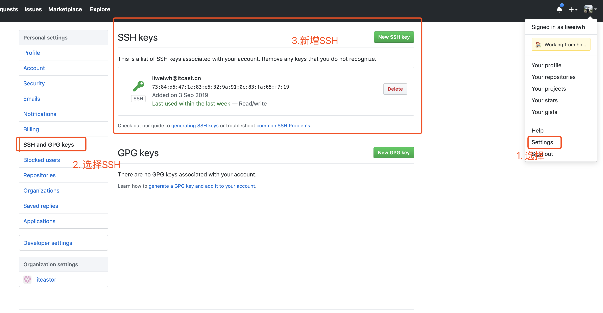

<h2 align="center">传智播客前端课程研究中心</h2>
## 介绍

这里是使用 vuepress 搭建的传智播客前端课程研究中心的首页网站 github 源代码。

## 安装

```
npm install

# 开发测试
npm run dev

# 构建打包
npm run build
```

## 部署

### 本地生成SSH密钥

```bash
ssh-keygen -t rsa -C "itcast@itcast.cn"
```

上面换成自己的密钥。

配置自己的github密钥。



配置`~/.ssh/config`文件：

```bash
Host itcast
  HostName github.com
  PreferredAuthentications publickey
  IdentityFile ~/.ssh/这里配置密钥路径
```


### 发布推送

使用`deploy.sh`脚本

```bash
# 给予执行权限
chmod +x deploy.sh

# 使用脚本推送
./deploy.sh
```

